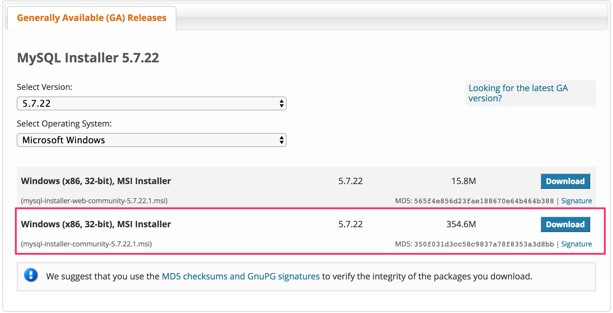
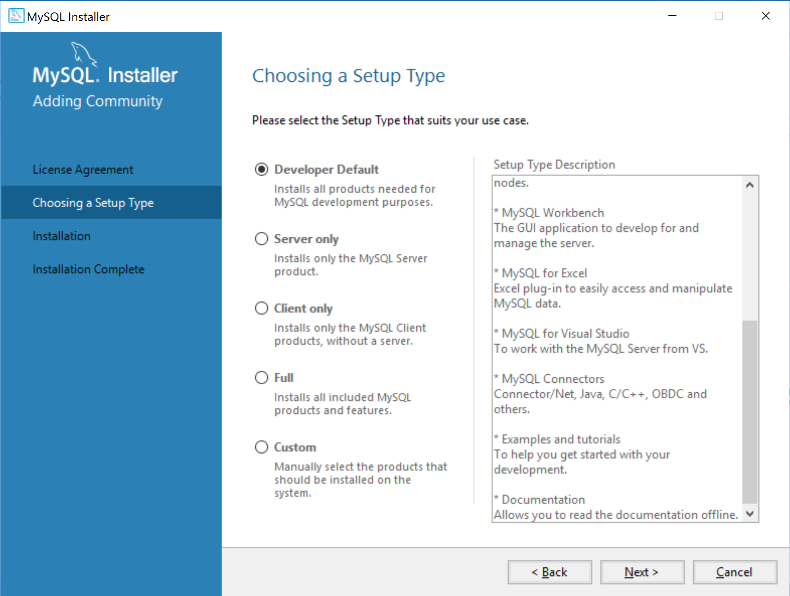
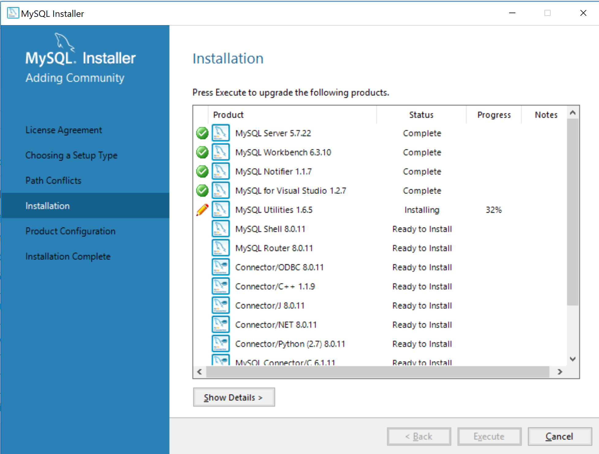
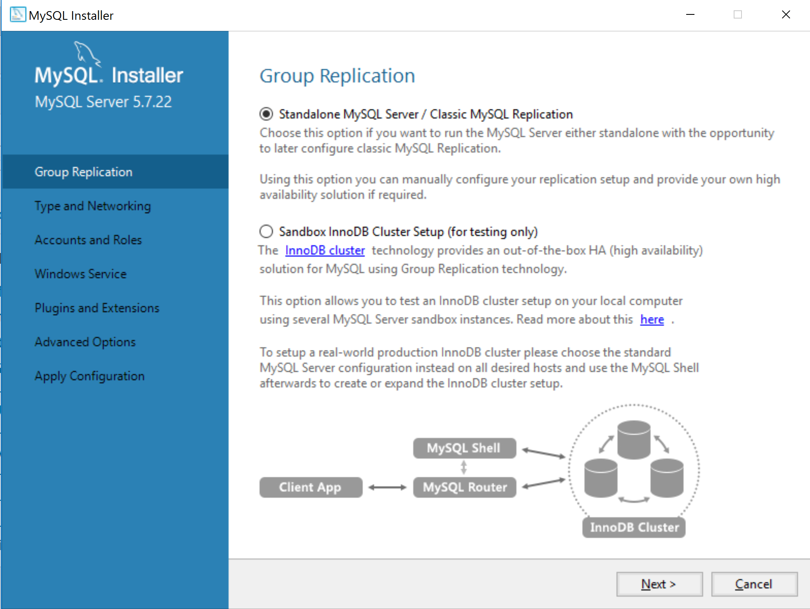
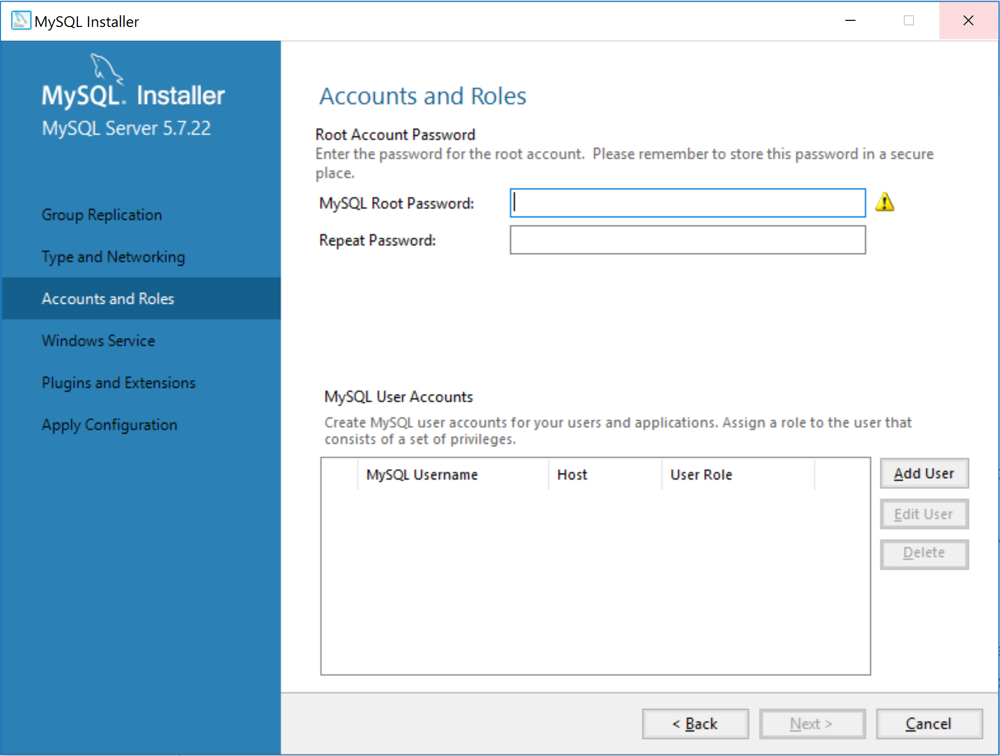

# Windows MySQL Installation

* Download the MySQL installer from [here](https://dev.mysql.com/downloads/windows/installer/5.7.html) and be sure to choose the larger of the two options.

  

* After the download has finished, open and run the installer.

* Agree to license then select **Developer Default** as the type of setup and click next.

  

* Next, the Installer checks to see if it can automatically install all the components for you. You may need to uninstall a previous version of MySQL, or manually install a component. Once all the requirement is met, you can press the 'Check' button to make sure the 'status' column is either 'completed' or empty. Press 'Execute' to move to the next step. Do NOT use the 'Next' button to bypass the requirement check. The installation will fail. 

  

* Continue clicking moving on to finish the installation. Once complete, click `execute` in the installation section. This will take some time while it downloads and installs the necessary programs.

  

* Once everything has been installed you will be directed the next part of the setup. Keep the default options as you continue through the next two steps.

  

* Next, you will be at the **Accounts and Roles** page. Create and record a root password for MySQL that you will remember. This will be used to connect your MySQL server locally and will cause issues if you forget.

  

* Continue through the rest of the set up keeping everything default. You'll need the password you created in the previous step. Once everything has finished, the MySQL Shell and MySQL Workbench will open. Exit the shell and keep the workbench open.
